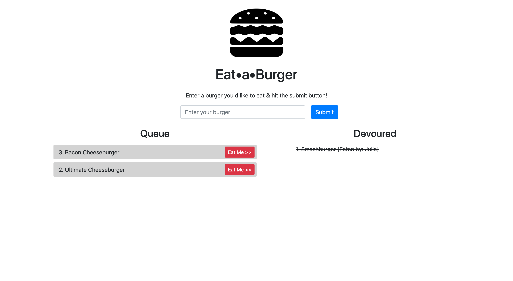

# Eat&bull;a&bull;Burger (sequelized version)

This is a restaurant app - users can input the names of burgers they'd like to eat.

There is a queue of burgers to be eaten, and a list of burgers that have already been devoured.

Once a burger is added to the queue:
- click the "Eat Me" button
- enter your name

and it will be moved to the Devoured list.  It displays who has eaten which burger.

This app was built with Node.js, Express, MySQL, Sequelize, and Handlebars.

[See it deployed ->](https://sequelized-burger25.herokuapp.com/)

